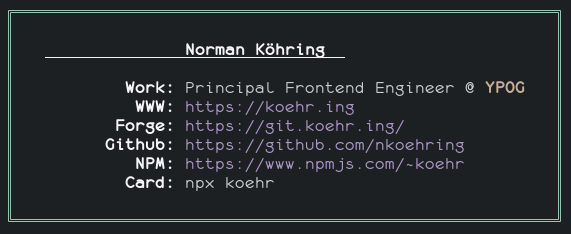

# [koehr](https://www.npmjs.com/package/koehr)

Being your own NPM package is fun!

<center></center>

Created a [business card](https://www.npmjs.com/package/koehr) highly inspired by [bitandbang](https://twitter.com/bitandbang)'s idea he [shared on twitter](https://twitter.com/bitandbang/status/1075473070368919552) and [AhsanAyaz](https://twitter.com/Ahsan_ayz).

This was forked from [nasirhussain](https://github.com/nasirhm/npm-nasirhussain) but basically rewritten completely.

Run below from your terminal.
```sh
npx koehr
```
